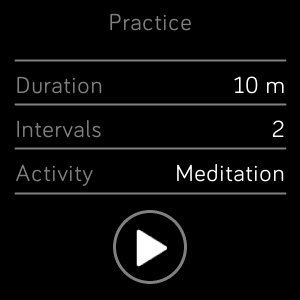
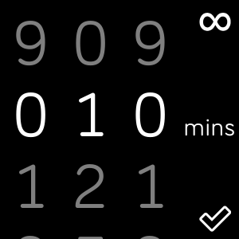
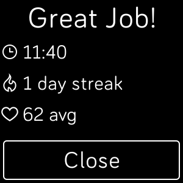

# practice
### A meditation timer for fitbit

\

## Features
* Automatically track your meditation practice
* Set interval vibrations to maintain mindfulness
* Extended timer for sessions you don't want to stop
## Upcoming
* Update to fitbit SDK 5.x
* Design overhaul for fitbit 5.0 OS guidelines
* Integration with fitbit's mindfullness api (when it's released)
